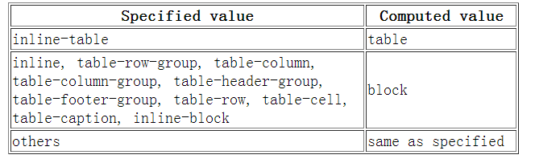

### display: none; 与 visibility: hidden; 的区别

相同： 它们都能让元素不可见

区别：

- display:none;会让元素完全从渲染树中消失，渲染的时候不占据任何空间；visibility: hidden;不会让元素从渲染树消失，渲染师元素继续占据空间，只是内容不可见
- display: none;是非继承属性，子孙节点消失由于元素从渲染树消失造成，通过修改子孙节点属性无法显示；visibility:hidden;是继承属性，子孙节点消失由于继承了 hidden，通过设置 visibility: visible;可以让子孙节点显式
- 修改常规流中元素的 display 通常会造成文档重排。修改 visibility 属性只会造成本元素的重绘
- 读屏器不会读取 display: none;元素内容；会读取 visibility: hidden 元素内容

### css hack 原理及常用 hack

原理：利用不同浏览器对 CSS 的支持和解析结果不一样编写针对特定浏览器样式。常见的 hack 有 1）属性 hack。2）选择器 hack。3）IE 条件注释

IE 条件注释：适用于[IE5, IE9]常见格式如下

```
<!--[if IE 6]>
Special instructions for IE 6 here
<![endif]-->
```

选择器 hack：不同浏览器对选择器的支持不一样

```
/***** Selector Hacks ******/

/* IE6 and below */
* html #uno  { color: red }

/* IE7 */
*:first-child+html #dos { color: red }

/* IE7, FF, Saf, Opera  */
html>body #tres { color: red }

/* IE8, FF, Saf, Opera (Everything but IE 6,7) */
html>/**/body #cuatro { color: red }

/* Opera 9.27 and below, safari 2 */
html:first-child #cinco { color: red }

/* Safari 2-3 */
html[xmlns*=""] body:last-child #seis { color: red }

/* safari 3+, chrome 1+, opera9+, ff 3.5+ */
body:nth-of-type(1) #siete { color: red }

/* safari 3+, chrome 1+, opera9+, ff 3.5+ */
body:first-of-type #ocho {  color: red }

/* saf3+, chrome1+ */
@media screen and (-webkit-min-device-pixel-ratio:0) {
 #diez  { color: red  }
}

/* iPhone / mobile webkit */
@media screen and (max-device-width: 480px) {
 #veintiseis { color: red  }
}

/* Safari 2 - 3.1 */
html[xmlns*=""]:root #trece  { color: red  }

/* Safari 2 - 3.1, Opera 9.25 */
*|html[xmlns*=""] #catorce { color: red  }

/* Everything but IE6-8 */
:root *> #quince { color: red  }

/* IE7 */
*+html #dieciocho {  color: red }

/* Firefox only. 1+ */
#veinticuatro,  x:-moz-any-link  { color: red }

/* Firefox 3.0+ */
#veinticinco,  x:-moz-any-link, x:default  { color: red  }
```

属性 hack：不同浏览器解析 bug 或方法

```
/* IE6 */
#once { _color: blue }

/* IE6, IE7 */
#doce { *color: blue; /* or #color: blue */ }

/* Everything but IE6 */
#diecisiete { color/**/: blue }

/* IE6, IE7, IE8 */
#diecinueve { color: blue\9; }

/* IE7, IE8 */
#veinte { color/*\**/: blue\9; }

/* IE6, IE7 -- acts as an !important */
#veintesiete { color: blue !ie; } /* string after ! can be anything */
```

### link 与 @import 的区别

- link 是 HTML 方式， @import 是 CSS 方式
- link 最大限度支持并行下载，@import 过多嵌套导致串行下载，出现 FOUC
- link 可以通过 rel="alternate stylesheet" 指定候选样式
- 浏览器对 link 支持早于@import ，可以使用 @import 对老浏览器隐藏样式
- @import 必须在样式规则之前，可以在 css 文件中引用其他文件
- 总体来说：link 优于@import

### CSS 有哪些继承属性

- 关于文字排版的属性如：
  - font
  - word-break
  - letter-spacing
  - text-align
  - text-rendering
  - word-spacing
  - white-space
  - text-indent
  - text-transform
  - text-shadow
- line-height
- color
- visibility
- cursor

### display,float,position 的关系

- 如果 display 为 none，那么 position 和 float 都不起作用，这种情况下元素不产生框
- 否则，如果 position 值为 absolute 或者 fixed，框就是绝对定位的，float 的计算值为 none，display 根据下面的表格进行调整
- 否则，如果 float 不是 none，框是浮动的，display 根据下表进行调整
- 否则，如果元素是根元素，display 根据下表进行调整
- 其他情况下 display 的值为指定值 总结起来：绝对定位、浮动、根元素都需要调整 display

  

### 外边距折叠(collapsing margins)

- 毗邻的两个或多个 margin 会合并成一个 margin，叫做外边距折叠。规则如下：
- 两个或多个毗邻的普通流中的块元素垂直方向上的 margin 会折叠
- 浮动元素或 inline-block 元素或绝对定位元素的 margin 不会和垂直方向上的其他元素的 margin 折叠
- 创建了块级格式化上下文的元素，不会和它的子元素发生 margin 折叠
- 元素自身的 margin-bottom 和 margin-top 相邻时也会折

### 介绍一下标准的 CSS 的盒子模型？低版本 IE 的盒子模型有什么不同的？

- 有两种， IE 盒子模型、W3C 盒子模型；
- 盒模型： 内容(content)、填充(padding)、边界(margin)、 边框(border)；
- 标准(W3C)盒模型：元素宽度 = width + padding + border + margin
- 怪异(IE)盒模型：元素宽度 = width + margin
- 区 别： IE 的 content 部分把 border 和 padding 计算了进去;
- 标准浏览器通过设置 css3 的 box-sizing: border-box 属性，触发“怪异模式”解析计算宽高

### CSS 选择符有哪些？

- id 选择器（ # myid）
- 类选择器（.myclassname）
- 标签选择器（div, h1, p）
- 相邻选择器（h1 + p）
- 子选择器（ul > li）
- 后代选择器（li a）
- 通配符选择器（ \* ）
- 属性选择器（a[rel = "external"]）
- 伪类选择器（a:hover, li:nth-child）

### CSS 优先级算法如何计算？

- 优先级就近原则，同权重情况下样式定义最近者为准
- 载入样式以最后载入的为准
- 优先级为: !important > id > class > tag important 比 内联优先级高

### CSS3 新增伪类有那些？

- p:first-of-type 选择属于其父元素的首个 <p> 元素的每个 <p> 元素。
- p:last-of-type 选择属于其父元素的最后 <p> 元素的每个 <p> 元素。
- p:only-of-type 选择属于其父元素唯一的 <p> 元素的每个 <p> 元素。
- p:only-child 选择属于其父元素的唯一子元素的每个 <p> 元素。
- p:nth-child(2) 选择属于其父元素的第二个子元素的每个 <p> 元素。

- :after 在元素之前添加内容,也可以用来做清除浮动。
- :before 在元素之后添加内容
- :enabled 选择器匹配每个已启用的元素（大多用在表单元素上）。
- :disabled 控制表单控件的禁用状态。
- :checked 单选框或复选框被选中

### 如何居中 div？如何居中一个浮动元素？如何让绝对定位的 div 居中？

如果需要居中的元素为常规流中 inline 元素，为父元素设置 text-align: center;即可实现

如果需要居中的元素为常规流中 block 元素，1）为元素设置宽度，2）设置左右 margin 为 auto。3）IE6 下需在父元素上设置 text-align: center;,再给子元素恢复需要的值

```
<body>
    <div class="content">
    aaaaaa aaaaaa a a a a a a a a
    </div>
</body>

<style>
    body {
        background: #DDD;
        text-align: center; /* 3 */
    }
    .content {
        width: 500px;      /* 1 */
        text-align: left;  /* 3 */
        margin: 0 auto;    /* 2 */

        background: purple;
    }
</style>
```

如果需要居中的元素为浮动元素，1）为元素设置宽度，2）position: relative;，3）浮动方向偏移量（left 或者 right）设置为 50%，4）浮动方向上的 margin 设置为元素宽度一半乘以-1

```
<body>
    <div class="content">
    aaaaaa aaaaaa a a a a a a a a
    </div>
</body>

<style>
    body {
        background: #DDD;
    }
    .content {
        width: 500px;         /* 1 */
        float: left;

        position: relative;   /* 2 */
        left: 50%;            /* 3 */
        margin-left: -250px;  /* 4 */

        background-color: purple;
    }
</style>
```

如果需要居中的元素为绝对定位元素，1）为元素设置宽度，2）偏移量设置为 50%，3）偏移方向外边距设置为元素宽度一半乘以-1

```
<body>
    <div class="content">
    aaaaaa aaaaaa a a a a a a a a
    </div>
</body>

<style>
    body {
        background: #DDD;
        position: relative;
    }
    .content {
        width: 800px;

        position: absolute;
        left: 50%;
        margin-left: -400px;

        background-color: purple;
    }
</style>
```

如果需要居中的元素为绝对定位元素，1）为元素设置宽度，2）设置左右偏移量都为 0,3）设置左右外边距都为 auto

```
<body>
    <div class="content">
    aaaaaa aaaaaa a a a a a a a a
    </div>
</body>

<style>
    body {
        background: #DDD;
        position: relative;
    }
    .content {
        width: 800px;

        position: absolute;
        margin: 0 auto;
        left: 0;
        right: 0;

        background-color: purple;
    }
</style>
```

### 如何竖直居中一个元素

- 绝对定位居中
- 如果居中的是行内元素，可以设置父级 height 与 line-height 相等
- 设置 margin/padding 居中
- 相对位置偏移居中
- flex 居中 设置 align-items:center 即可

### display 有哪些值？说明他们的作用

- block 象块类型元素一样显示。
- none 缺省值。象行内元素类型一样显示。
- inline-block 象行内元素一样显示，但其内容象块类型元素一样显示。
- list-item 象块类型元素一样显示，并添加样式列表标记。
- table 此元素会作为块级表格来显示
- inherit 规定应该从父元素继承 display 属性的值

### position 有哪些值 relative 和 absolute 定位原点是？

- absolute 生成绝对定位的元素，相对于值不为 static 的第一个父元素进行定位。
- fixed （老 IE 不支持） 生成绝对定位的元素，相对于浏览器窗口进行定位。
- relative 生成相对定位的元素，相对于其正常位置进行定位。
- static 默认值。没有定位，元素出现在正常的流中（忽略 top, bottom, left, right - z-index 声明）。
- inherit 规定从父元素继承 position 属性的值
