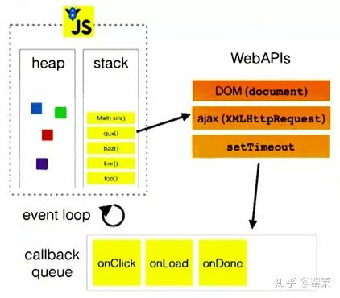

### JavaScript 的组成

JavaScript 由以下三部分组成：

-   ECMAScript（核心）：JavaScript 语言基础
-   DOM（文档对象模型）：规定了访问 HTML 和 XML 的接口
-   BOM（浏览器对象模型）：提供了浏览器窗口之间进行交互的对象和方法

### JS 的基本数据类型和引用数据类型

-   基本数据类型：undefined、null、boolean、number、string、symbol
-   引用数据类型：object、array、function

### 检测浏览器版本版本有哪些方式？

-   根据 navigator.userAgent // UA.toLowerCase().indexOf('chrome')
-   根据 window 对象的成员 // 'ActiveXObject' in window

### 介绍 JS 有哪些内置对象？

-   数据封装类对象：Object、Array、Boolean、Number、String
-   其他对象：Function、Arguments、Math、Date、RegExp、Error
-   ES6 新增对象：Symbol、Map、Set、Promises、Proxy、Reflect

### 说几条写 JavaScript 的基本规范？

-   代码缩进，建议使用“四个空格”缩进
-   代码段使用花括号{}包裹
-   语句结束使用分号;
-   变量和函数在使用前进行声明
-   以大写字母开头命名构造函数，全大写命名常量
-   规范定义 JSON 对象，补全双引号
-   用{}和[]声明对象和数组

### 如何编写高性能的 JavaScript？

-   遵循严格模式："use strict";
-   将 js 脚本放在页面底部，加快渲染页面
-   将 js 脚本将脚本成组打包，减少请求
-   使用非阻塞方式下载 js 脚本
-   尽量使用局部变量来保存全局变量
-   尽量减少使用闭包
-   使用 window 对象属性方法时，省略 window
-   尽量减少对象成员嵌套
-   缓存 DOM 节点的访问
-   通过避免使用 eval() 和 Function() 构造器
-   给 setTimeout() 和 setInterval() 传递函数而不是字符串作为参数
-   尽量使用直接量创建对象和数组
-   最小化重绘(repaint)和回流(reflow)

### DOM 元素 e 的 e.getAttribute(propName)和 e.propName 有什么区别和联系

-   e.getAttribute()，是标准 DOM 操作文档元素属性的方法，具有通用性可在任意文档上使用，返回元素在源文件中设置的属性
-   e.propName 通常是在 HTML 文档中访问特定元素的特性，浏览器解析元素后生成对应对象（如 a 标签生成 HTMLAnchorElement），这些对象的特性会根据特定规则结合属性设置得到，对于没有对应特性的属性，只能使用 getAttribute 进行访问
-   e.getAttribute()返回值是源文件中设置的值，类型是字符串或者 null（有的实现返回""）
-   e.propName 返回值可能是字符串、布尔值、对象、undefined 等
-   大部分 attribute 与 property 是一一对应关系，修改其中一个会影响另一个，如 id，title 等属性
-   一些布尔属性`<input hidden/>`的检测设置需要 hasAttribute 和 removeAttribute 来完成，或者设置对应 property
-   像`<a href="../index.html">link</a>`中 href 属性，转换成 property 的时候需要通过转换得到完整 URL
-   一些 attribute 和 property 不是一一对应如：form 控件中`<input value="hello"/>`对应的是 defaultValue，修改或设置 value property 修改的是控件当前值，setAttribute 修改 value 属性不会改变 value property

### offsetWidth/offsetHeight,clientWidth/clientHeight 与 scrollWidth/scrollHeight 的区别

-   offsetWidth/offsetHeight 返回值包含 content + padding + border，效果与 e.getBoundingClientRect()相同
-   clientWidth/clientHeight 返回值只包含 content + padding，如果有滚动条，也不包含滚动条
-   scrollWidth/scrollHeight 返回值包含 content + padding + 溢出内容的尺寸

### 描述浏览器的渲染过程，DOM 树和渲染树的区别？

浏览器的渲染过程：

-   解析 HTML 构建 DOM(DOM 树)，并行请求 css/image/js
-   CSS 文件下载完成，开始构建 CSSOM(CSS 树)
-   CSSOM 构建结束后，和 DOM 一起生成 Render Tree(渲染树)
-   布局(Layout)：计算出每个节点在屏幕中的位置
-   显示(Painting)：通过显卡把页面画到屏幕上

DOM 树 和 渲染树 的区别：

-   DOM 树与 HTML 标签一一对应，包括 head 和隐藏元素
-   渲染树不包括 head 和隐藏元素，大段文本的每一个行都是独立节点，每一个节点都有对应的 css 属性

### 重绘和回流（重排）的区别和关系？

-   重绘：当渲染树中的元素外观（如：颜色）发生改变，不影响布局时，产生重绘
-   回流：当渲染树中的元素的布局（如：尺寸、位置、隐藏/状态状态）发生改变时，产生重绘回流
-   注意：JS 获取 Layout 属性值（如：offsetLeft、scrollTop、getComputedStyle 等）也会引起回流。因为浏览器需要通过回流计算最新值
-   回流必将引起重绘，而重绘不一定会引起回流

### 如何最小化重绘(repaint)和回流(reflow)？

-   需要要对元素进行复杂的操作时，可以先隐藏(display:"none")，操作完成后再显示
-   需要创建多个 DOM 节点时，使用 DocumentFragment 创建完后一次性的加入 document
-   缓存 Layout 属性值，如：var left = elem.offsetLeft; 这样，多次使用 left 只产生一次回流
-   尽量避免用 table 布局（table 元素一旦触发回流就会导致 table 里所有的其它元素回流）
-   避免使用 css 表达式(expression)，因为每次调用都会重新计算值（包括加载页面）
-   尽量使用 css 属性简写，如：用 border 代替 border-width, border-style, border-color
    批量修改元素样式：elem.className 和 elem.style.cssText 代替 elem.style.xxx

### script 的位置是否会影响首屏显示时间？

-   在解析 HTML 生成 DOM 过程中，js 文件的下载是并行的，不需要 DOM 处理到 script 节点。因此，script 的位置不影响首屏显示的开始时间。
-   浏览器解析 HTML 是自上而下的线性过程，script 作为 HTML 的一部分同样遵循这个原则
-   因此，script 会延迟 DomContentLoad，只显示其上部分首屏内容，从而影响首屏显示的完成时间

### 解释 JavaScript 中的作用域与变量声明提升？

JavaScript 作用域：

-   在 Java、C 等语言中，作用域为 for 语句、if 语句或{}内的一块区域，称为作用域；
-   而在 JavaScript 中，作用域为 function(){}内的区域，称为函数作用域。

JavaScript 变量声明提升：

-   在 JavaScript 中，函数声明与变量声明经常被 JavaScript 引擎隐式地提升到当前作用域的顶部。
-   声明语句中的赋值部分并不会被提升，只有名称被提升
-   函数声明的优先级高于变量，如果变量名跟函数名相同且未赋值，则函数声明会覆盖变量声明
-   如果函数有多个同名参数，那么最后一个参数（即使没有定义）会覆盖前面的同名参数

### 介绍 JavaScript 的原型，原型链？有什么特点？

原型：

-   JavaScript 的所有对象中都包含了一个 [proto] 内部属性，这个属性所对应的就是该对象的原型
-   JavaScript 的函数对象，除了原型 [proto] 之外，还预置了 prototype 属性
-   当函数对象作为构造函数创建实例时，该 prototype 属性值将被作为实例对象的原型 [proto]。

原型链：

-   当一个对象调用的属性/方法自身不存在时，就会去自己 [proto] 关联的前辈 prototype 对象上去找
-   如果没找到，就会去该 prototype 原型 [proto] 关联的前辈 prototype 去找。依次类推，直到找到属性/方法或 undefined 为止。从而形成了所谓的“原型链”

原型特点：

-   JavaScript 对象是通过引用来传递的，当修改原型时，与之相关的对象也会继承这一改变

### JavaScript 有几种类型的值？，你能画一下他们的内存图吗

-   原始数据类型（Undefined，Null，Boolean，Number、String）-- 栈
-   引用数据类型（对象、数组和函数）-- 堆
-   两种类型的区别是：存储位置不同：
-   原始数据类型是直接存储在栈(stack)中的简单数据段，占据空间小、大小固定，属于被频繁使用数据；
-   引用数据类型存储在堆(heap)中的对象，占据空间大、大小不固定，如果存储在栈中，将会影响程序运行的性能；
-   引用数据类型在栈中存储了指针，该指针指向堆中该实体的起始地址。
-   当解释器寻找引用值时，会首先检索其在栈中的地址，取得地址后从堆中获得实体。

### JavaScript 如何实现一个类，怎么实例化这个类？

1. 构造函数法（this + prototype） -- 用 new 关键字 生成实例对象
    - 缺点：用到了 this 和 prototype，编写复杂，可读性差

```js
  function Mobile(name, price){
     this.name = name;
     this.price = price;
   }
   Mobile.prototype.sell = function(){
      alert(this.name + "，售价 $" + this.price);
   }
   var iPhone7 = new Mobile("iPhone7", 1000);
   iPhone7.sell();
```

2. Object.create 法 -- 用 Object.create() 生成实例对象
    - 缺点：不能实现私有属性和私有方法，实例对象之间也不能共享数据

```js
 var Person = {
     firstname: "Mark",
     lastname: "Yun",
     age: 25,
     introduce: function(){
         alert('I am ' + Person.firstname + ' ' + Person.lastname);
     }
 };

 var person = Object.create(Person);
 person.introduce();

 // Object.create 要求 IE9+，低版本浏览器可以自行部署：
 if (!Object.create) {
　   Object.create = function (o) {
　　　 function F() {}
　　　 F.prototype = o;
　　　 return new F();
　　};
　}
```

3. 极简主义法（消除 this 和 prototype） -- 调用 createNew() 得到实例对象
    - 优点：容易理解，结构清晰优雅，符合传统的"面向对象编程"的构造

```js
 var Cat = {
   age: 3, // 共享数据 -- 定义在类对象内，createNew() 外
   createNew: function () {
     var cat = {};
     // var cat = Animal.createNew(); // 继承 Animal 类
     cat.name = "小咪";
     var sound = "喵喵喵"; // 私有属性--定义在 createNew() 内，输出对象外
     cat.makeSound = function () {
       alert(sound);  // 暴露私有属性
     };
     cat.changeAge = function(num){
       Cat.age = num; // 修改共享数据
     };
     return cat; // 输出对象
   }
 };

 var cat = Cat.createNew();
 cat.makeSound();
```

4. ES6 语法糖 class -- 用 new 关键字 生成实例对象

```js
     class Point {
       constructor(x, y) {
         this.x = x;
         this.y = y;
       }
       toString() {
         return '(' + this.x + ', ' + this.y + ')';
       }
     }

  var point = new Point(2, 3);
```

### Javascript 如何实现继承？

1. 构造函数绑定：使用 call 或 apply 方法，将父对象的构造函数绑定在子对象上

```js
function Cat(name,color){
 　Animal.apply(this, arguments);
 　this.name = name;
 　this.color = color;
}
```

2. 实例继承：将子对象的 prototype 指向父对象的一个实例

```js
Cat.prototype = new Animal();
Cat.prototype.constructor = Cat;
```

3. 拷贝继承：如果把父对象的所有属性和方法，拷贝进子对象

```js
function extend(Child, Parent) {
　　　var p = Parent.prototype;
　　　var c = Child.prototype;
　　　for (var i in p) {
　　　   c[i] = p[i];
　　　}
　　　c.uber = p;
}
```

4. 原型继承：将子对象的 prototype 指向父对象的 prototype

```js
function extend(Child, Parent) {
    var F = function(){};
    　F.prototype = Parent.prototype;
    　Child.prototype = new F();
    　Child.prototype.constructor = Child;
    　Child.uber = Parent.prototype;
}
```

5. ES6 语法糖 extends：class ColorPoint extends Point {}

```js
class ColorPoint extends Point {
    constructor(x, y, color) {
        super(x, y); // 调用父类的constructor(x, y)
        this.color = color;
    }
    toString() {
        return this.color + ' ' + super.toString(); // 调用父类的toString()
    }
}
```

### js 继承方式及其优缺点

原型链继承的缺点

-   一是字面量重写原型会中断关系，使用引用类型的原型，并且子类型还无法给超类型传递参数。

借用构造函数（类式继承）

-   借用构造函数虽然解决了刚才两种问题，但没有原型，则复用无从谈起。所以我们需要原型链+借用构造函数的模式，这种模式称为组合继承

组合式继承

-   组合式继承是比较常用的一种继承方法，其背后的思路是使用原型链实现对原型属性和方法的继承，而通过借用构造函数来实现对实例属性的继承。这样，既通过在原型上定义方法实现了函数复用，又保证每个实例都有它自己的属性。

### javascript 创建对象的几种方式？

javascript 创建对象简单的说,无非就是使用内置对象或各种自定义对象，当然还可以用 JSON；但写法有很多种，也能混合使用

1. 对象字面量的方式

```js
person={firstname:"Mark",lastname:"Yun",age:25,eyecolor:"black"};
```

2. 用 function 来模拟无参的构造函数

```js
 function Person(){}
    var person=new Person();//定义一个function，如果使用new"实例化",该function可以看作是一个Class
        person.name="Mark";
        person.age="25";
        person.work=function(){
        alert(person.name+" hello...");
    }
person.work();
```

3. 用 function 来模拟参构造函数来实现（用 this 关键字定义构造的上下文属性）

```js
function Pet(name,age,hobby){
    this.name=name;//this作用域：当前对象
    this.age=age;
    this.hobby=hobby;
    this.eat=function(){
        alert("我叫"+this.name+",我喜欢"+this.hobby+",是个程序员");
    }
}
var maidou =new Pet("麦兜",25,"coding");//实例化、创建对象
maidou.eat();//调用eat方法
```

4. 用工厂方式来创建（内置对象）

```js
var wcDog =new Object();
     wcDog.name="旺财";
     wcDog.age=3;
wcDog.work=function(){
    alert("我是"+wcDog.name+",汪汪汪......");
}
wcDog.work();
```

5. 用原型方式来创建

```js
function Dog(){

    }
Dog.prototype.name="旺财";
Dog.prototype.eat=function(){
    alert(this.name+"是个吃货");
}
var wangcai =new Dog();
wangcai.eat();
```

6. 用混合方式来创建

```js
function Car(name,price){
    this.name=name;
    this.price=price;
}
    Car.prototype.sell=function(){
    alert("我是"+this.name+"，我现在卖"+this.price+"万元");
    }
var camry =new Car("凯美瑞",27);
camry.sell();
```

### Javascript 作用链域?

-   全局函数无法查看局部函数的内部细节，但局部函数可以查看其上层的函数细节，直至全局细节
-   如果当前作用域没有找到属性或方法，会向上层作用域查找，直至全局函数，这种形式就是作用域链

### 谈谈 this 对象的理解

-   this 总是指向函数的直接调用者
-   如果有 new 关键字，this 指向 new 出来的实例对象
-   在事件中，this 指向触发这个事件的对象
-   IE 下 attachEvent 中的 this 总是指向全局对象 Window

### eval 是做什么的？

eval 的功能是把对应的字符串解析成 JS 代码并运行

-   应该避免使用 eval，不安全，非常耗性能（先解析成 js 语句，再执行）
-   由 JSON 字符串转换为 JSON 对象的时候可以用 eval('('+ str +')');

### 什么是 Window 对象? 什么是 Document 对象?

-   Window 对象表示当前浏览器的窗口，是 JavaScript 的顶级对象。
-   我们创建的所有对象、函数、变量都是 Window 对象的成员。
-   Window 对象的方法和属性是在全局范围内有效的。
-   Document 对象是 HTML 文档的根节点与所有其他节点（元素节点，文本节点，属性节点, 注释节点）
-   Document 对象使我们可以通过脚本对 HTML 页面中的所有元素进行访问
-   Document 对象是 Window 对象的一部分，可通过 window.document 属性对其进行访问

### 介绍 DOM 的发展

-   DOM：文档对象模型（Document Object Model），定义了访问 HTML 和 XML 文档的标准，与编程语言及平台无关
-   DOM0：提供了查询和操作 Web 文档的内容 API。未形成标准，实现混乱。如：document.forms['login']
-   DOM1：W3C 提出标准化的 DOM，简化了对文档中任意部分的访问和操作。如：JavaScript 中的 Document 对象
-   DOM2：原来 DOM 基础上扩充了鼠标事件等细分模块，增加了对 CSS 的支持。如：getComputedStyle(elem, pseudo)
-   DOM3：增加了 XPath 模块和加载与保存（Load and Save）模块。如：XPathEvaluator

### 介绍 DOM0，DOM2，DOM3 事件处理方式区别

DOM0 级事件处理方式：

-   btn.onclick = func;
-   btn.onclick = null;

DOM2 级事件处理方式：

-   btn.addEventListener('click', func, false);
-   btn.removeEventListener('click', func, false);
-   btn.attachEvent("onclick", func);
-   btn.detachEvent("onclick", func);

DOM3 级事件处理方式：

-   eventUtil.addListener(input, "textInput", func);
-   eventUtil 是自定义对象，textInput 是 DOM3 级事件

### 事件的三个阶段

捕获、目标、冒泡

### 介绍事件“捕获”和“冒泡”执行顺序和事件的执行次数？

按照 W3C 标准的事件：首是进入捕获阶段，直到达到目标元素，再进入冒泡阶段

事件执行次数（DOM2-addEventListener）：元素上绑定事件的个数

-   注意 1：前提是事件被确实触发
-   注意 2：事件绑定几次就算几个事件，即使类型和功能完全一样也不会“覆盖”

事件执行顺序：判断的关键是否目标元素

-   非目标元素：根据 W3C 的标准执行：捕获->目标元素->冒泡（不依据事件绑定顺序）
-   目标元素：依据事件绑定顺序：先绑定的事件先执行（不依据捕获冒泡标准）
-   最终顺序：父元素捕获->目标元素事件 1->目标元素事件 2->子元素捕获->子元素冒泡->父元素冒泡
-   注意：子元素事件执行前提 事件确实“落”到子元素布局区域上，而不是简单的具有嵌套关系

### 在一个 DOM 上同时绑定两个点击事件：一个用捕获，一个用冒泡。事件会执行几次，先执行冒泡还是捕获？

-   该 DOM 上的事件如果被触发，会执行两次（执行次数等于绑定次数）
-   如果该 DOM 是目标元素，则按事件绑定顺序执行，不区分冒泡/捕获
-   如果该 DOM 是处于事件流中的非目标元素，则先执行捕获，后执行冒泡

### 事件的代理/委托

事件委托是指将事件绑定目标元素的到父元素上，利用冒泡机制触发该事件

优点：

-   可以减少事件注册，节省大量内存占用
-   可以将事件应用于动态添加的子元素上

缺点： 使用不当会造成事件在不应该触发时触发

示例：

```js
ulEl.addEventListener('click', function(e){
    var target = event.target || event.srcElement;
    if(!!target && target.nodeName.toUpperCase() === "LI"){
        console.log(target.innerHTML);
    }
}, false);
```

### IE 与火狐的事件机制有什么区别？ 如何阻止冒泡？

IE 只事件冒泡，不支持事件捕获；火狐同时支持件冒泡和事件捕获。

阻止冒泡：

-   取消默认操作: w3c 的方法是 e.preventDefault()，IE 则是使用 e.returnValue = false;
-   return false javascript 的 return false 只会阻止默认行为，而是用 jQuery 的话则既阻止默认行为又防止对象冒泡。
-   阻止冒泡 w3c 的方法是 e.stopPropagation()，IE 则是使用 e.cancelBubble = true

```js
[js] view plaincopy
function stopHandler(event)

    window.event?window.event.cancelBubble=true:event.stopPropagation();

}
```

参考链接:[浅谈 javascript 事件取消和阻止冒泡-开源中国 2015](http://wiki.jikexueyuan.com/project/brief-talk-js/event-cancellation-and-prevent-bubbles.html)

### IE 的事件处理和 W3C 的事件处理有哪些区别？(必考)

绑定事件

-   W3C: targetEl.addEventListener('click', handler, false);
-   IE: targetEl.attachEvent('onclick', handler);

删除事件

-   W3C: targetEl.removeEventListener('click', handler, false);
-   IE: targetEl.detachEvent(event, handler);

事件对象

-   W3C: var e = arguments.callee.caller.arguments[0]
-   IE: window.event

事件目标

-   W3C: e.target
-   IE: window.event.srcElement

阻止事件默认行为

-   W3C: e.preventDefault()
-   IE: window.event.returnValue = false'

阻止事件传播

-   W3C: e.stopPropagation()
-   IE: window.event.cancelBubble = true

### W3C 事件的 target 与 currentTarget 的区别？

-   target 只会出现在事件流的目标阶段
-   currentTarget 可能出现在事件流的任何阶段
-   当事件流处在目标阶段时，二者的指向相同
-   当事件流处于捕获或冒泡阶段时：currentTarget 指向当前事件活动的对象(一般为父级)

### 如何派发事件(dispatchEvent)？（如何进行事件广播？）

-   W3C: 使用 dispatchEvent 方法
-   IE: 使用 fireEvent 方法

```js
var fireEvent = function(element, event){
    if (document.createEventObject){
        var mockEvent = document.createEventObject();
        return element.fireEvent('on' + event, mockEvent)
    }else{
        var mockEvent = document.createEvent('HTMLEvents');
        mockEvent.initEvent(event, true, true);
        return !element.dispatchEvent(mockEvent);
    }
}
```

### 什么是函数节流？介绍一下应用场景和原理？

-   函数节流(throttle)是指阻止一个函数在很短时间间隔内连续调用。 只有当上一次函数执行后达到规定的时间间隔，才能进行下一次调用。 但要保证一个累计最小调用间隔（否则拖拽类的节流都将无连续效果）
-   函数节流用于 onresize, onscroll 等短时间内会多次触发的事件
-   函数节流的原理：使用定时器做时间节流。 当触发一个事件时，先用 setTimout 让这个事件延迟一小段时间再执行。 如果在这个时间间隔内又触发了事件，就 clearTimeout 原来的定时器， 再 setTimeout 一个新的定时器重复以上流程。

函数节流简单实现：

```js
function throttle(method, context) {
     clearTimeout(methor.tId);
     method.tId = setTimeout(function(){
         method.call(context);
     }， 100); // 两次调用至少间隔 100ms
}
// 调用
window.onresize = function(){
    throttle(myFunc, window);
}
```

### 区分什么是“客户区坐标”、“页面坐标”、“屏幕坐标”？

-   客户区坐标：鼠标指针在可视区中的水平坐标(clientX)和垂直坐标(clientY)
-   页面坐标：鼠标指针在页面布局中的水平坐标(pageX)和垂直坐标(pageY)
-   屏幕坐标：设备物理屏幕的水平坐标(screenX)和垂直坐标(screenY)

### 如何获得一个 DOM 元素的绝对位置？

-   elem.offsetLeft：返回元素相对于其定位父级左侧的距离
-   elem.offsetTop：返回元素相对于其定位父级顶部的距离
-   elem.getBoundingClientRect()：返回一个 DOMRect 对象，包含一组描述边框的只读属性，单位像素

### 分析 ['1', '2', '3'].map(parseInt) 答案是多少？（常考）

答案:[1, NaN, NaN]

parseInt(string, radix) 第 2 个参数 radix 表示进制。省略 radix 或 radix = 0，则数字将以十进制解析

map 每次为 parseInt 传 3 个参数(elem, index, array)，其中 index 为数组索引

因此，map 遍历 ["1", "2", "3"]，相应 parseInt 接收参数如下

```js
parseInt('1', 0);  // 1
parseInt('2', 1);  // NaN
parseInt('3', 2);  // NaN
```

所以，parseInt 参数 radix 不合法，导致返回值为 NaN

### new 操作符具体干了什么？

-   创建实例对象，this 变量引用该对象，同时还继承了构造函数的原型
-   属性和方法被加入到 this 引用的对象中
-   新创建的对象由 this 所引用，并且最后隐式的返回 this

### 用原生 JavaScript 的实现过什么功能吗？

封装选择器、调用第三方 API、设置和获取样式(自由回答)

### 解释一下这段代码的意思吗？

```js
  [].forEach.call($$("*"), function(el){
      el.style.outline = "1px solid #" + (~~(Math.random()*(1<<24))).toString(16);
  })
```

解释：获取页面所有的元素，遍历这些元素，为它们添加 1 像素随机颜色的轮廓(outline)

-   $$(sel) // $$函数被许多现代浏览器命令行支持，等价于 document.querySelectorAll(sel)
-   [].forEach.call(NodeLists) // 使用 call 函数将数组遍历函数 forEach 应到节点元素列表
-   el.style.outline = "1px solid #333" // 样式 outline 位于盒模型之外，不影响元素布局位置
-   (1<<24) // parseInt("ffffff", 16) == 16777215 == 2^24 - 1 // 1<<24 == 2^24 == 16777216
-   Math.random()\*(1<<24) // 表示一个位于 0 到 16777216 之间的随机浮点数
-   ~~Math.random()\*(1<<24) // ~~ 作用相当于 parseInt 取整
-   (~~(Math.random()\*(1<<24))).toString(16) // 转换为一个十六进制-

### JavaScript 实现异步编程的方法？

-   回调函数
-   事件监听
-   发布/订阅
-   Promises 对象
-   Async 函数[ES7]

### web 开发中会话跟踪的方法有哪些

-   cookie
-   session
-   url 重写
-   隐藏 input
-   ip 地址

### 什么是闭包（closure），为什么要用它？

闭包是指有权访问另一个函数作用域中变量的函数，创建闭包的最常见的方式就是在一个函数内创建另一个函数，通过另一个函数访问这个函数的局部变量,利用闭包可以突破作用链域

闭包的特性：

-   函数内再嵌套函数
-   内部函数可以引用外层的参数和变量
-   参数和变量不会被垃圾回收机制回收

### javascript 代码中的"use strict";是什么意思 ? 使用它区别是什么？

use strict 是一种 ECMAscript 5 添加的（严格）运行模式,这种模式使得 Javascript 在更严格的条件下运行,使 JS 编码更加规范化的模式,消除 Javascript 语法的一些不合理、不严谨之处，减少一些怪异行为

### 如何判断一个对象是否属于某个类？

```js
// 使用instanceof （待完善）
   if(a instanceof Person){
       alert('yes');
   }
```

### js 延迟加载的方式有哪些？

defer 和 async、动态创建 DOM 方式（用得最多）、按需异步载入 js

### defer 和 async

defer 并行加载 js 文件，会按照页面上 script 标签的顺序执行 async 并行加载 js 文件，下载完成立即执行，不会按照页面上 script 标签的顺序执行

### Ajax 是什么? 如何创建一个 Ajax？

ajax 的全称：Asynchronous Javascript And XML

异步传输+js+xml

所谓异步，在这里简单地解释就是：向服务器发送请求的时候，我们不必等待结果，而是可以同时做其他的事情，等到有了结果它自己会根据设定进行后续操作，与此同时，页面是不会发生整页刷新的，提高了用户体验

-   创建 XMLHttpRequest 对象,也就是创建一个异步调用对象
-   建一个新的 HTTP 请求,并指定该 HTTP 请求的方法、URL 及验证信息
-   设置响应 HTTP 请求状态变化的函数
-   发送 HTTP 请求
-   获取异步调用返回的数据
-   用 JavaScript 和 DOM 实现局部刷新

### 同步和异步的区别?

-   同步：浏览器访问服务器请求，用户看得到页面刷新，重新发请求,等请求完，页面刷新，新内容出现，用户看到新内容,进行下一步操作
-   异步：浏览器访问服务器请求，用户正常操作，浏览器后端进行请求。等请求完，页面不刷新，新内容也会出现，用户看到新内容

### documen.write 和 innerHTML 的区别

-   document.write 只能重绘整个页面
-   innerHTML 可以重绘页面的一部分

### DOM 操作——怎样添加、移除、移动、复制、创建和查找节点?

创建新节点

-   createDocumentFragment() //创建一个 DOM 片段
-   createElement() //创建一个具体的元素
-   createTextNode() //创建一个文本节点

添加、移除、替换、插入

-   appendChild()
-   removeChild()
-   replaceChild()
-   insertBefore() //在已有的子节点前插入一个新的子节点

查找

-   getElementsByTagName() //通过标签名称
-   getElementsByName() // 通过元素的 Name 属性的值(IE 容错能力较强，会得到一个数组，其中包括 id 等于 name 值的) \* getElementById() //通过元素 Id，唯一性

### 那些操作会造成内存泄漏？

-   内存泄漏指任何对象在您不再拥有或需要它之后仍然存在
-   垃圾回收器定期扫描对象，并计算引用了每个对象的其他对象的数量。如果一个对象的引用数量为 0（没有其他对象引用过该对象），或对该对象的惟一引用是循环的，那么该对象的内存即可回收
-   setTimeout 的第一个参数使用字符串而非函数的话，会引发内存泄漏
-   闭包、控制台日志、循环（在两个对象彼此引用且彼此保留时，就会产生一个循环）

### 渐进增强和优雅降级

-   渐进增强 ：针对低版本浏览器进行构建页面，保证最基本的功能，然后再针对高级浏览器进行效果、交互等改进和追加功能达到更好的用户体验。
-   优雅降级 ：一开始就构建完整的功能，然后再针对低版本浏览器进行兼容

### Javascript 垃圾回收方法

标记清除（mark and sweep）

-   这是 JavaScript 最常见的垃圾回收方式，当变量进入执行环境的时候，比如函数中声明一个变量，垃圾回收器将其标记为“进入环境”，当变量离开环境的时候（函数执行结束）将其标记为“离开环境”
-   垃圾回收器会在运行的时候给存储在内存中的所有变量加上标记，然后去掉环境中的变量以及被环境中变量所引用的变量（闭包），在这些完成之后仍存在标记的就是要删除的变量了

引用计数(reference counting)

-   在低版本 IE 中经常会出现内存泄露，很多时候就是因为其采用引用计数方式进行垃圾回收。引用计数的策略是跟踪记录每个值被使用的次数，当声明了一个 变量并将一个引用类型赋值给该变量的时候这个值的引用次数就加 1，如果该变量的值变成了另外一个，则这个值得引用次数减 1，当这个值的引用次数变为 0 的时 候，说明没有变量在使用，这个值没法被访问了，因此可以将其占用的空间回收，这样垃圾回收器会在运行的时候清理掉引用次数为 0 的值占用的空间

参考链接 [内存管理-MDN](https://developer.mozilla.org/zh-CN/docs/Web/JavaScript/Memory_Management)

### 用过哪些设计模式？

1. 工厂模式：

-   主要好处就是可以消除对象间的耦合，通过使用工程方法而不是 new 关键字。将所有实例化的代码集中在一个位置防止代码重复
-   工厂模式解决了重复实例化的问题 ，但还有一个问题,那就是识别问题，因为根本无法 搞清楚他们到底是哪个对象的实例

```js
function createObject(name,age,profession){
    //集中实例化的函数
    var obj = new Object();
    obj.name = name;
    obj.age = age;
    obj.profession = profession;
    obj.move = function () {
        return this.name + ' at ' + this.age + ' engaged in ' + this.profession;
    };
    return obj;
}
var test1 = createObject('trigkit4',22,'programmer');//第一个实例var test2 = createObject('mike',25,'engineer');//第二个实例
```

2. 构造函数模式

-   使用构造函数的方法 ，即解决了重复实例化的问题 ，又解决了对象识别的问题，该模式与工厂模式的不同之处在于
-   构造函数方法没有显示的创建对象 (new Object());
-   直接将属性和方法赋值给 this 对象;
-   没有 renturn 语句

### 说说你对闭包的理解

使用闭包主要是为了设计私有的方法和变量。闭包的优点是可以避免全局变量的污染，缺点是闭包会常驻内存，会增大内存使用量，使用不当很容易造成内存泄露。在 js 中，函数即闭包，只有函数才会产生作用域的概念

闭包有三个特性：

-   函数嵌套函数
-   函数内部可以引用外部的参数和变量
-   参数和变量不会被垃圾回收机制回收

### 请解释一下 JavaScript 的同源策略

-   概念:同源策略是客户端脚本（尤其是 Javascript）的重要的安全度量标准。它最早出自 Netscape Navigator2.0，其目的是防止某个文档或脚本从多个不同源装载。这里的同源策略指的是：协议，域名，端口相同，同源策略是一种安全协议
-   指一段脚本只能读取来自同一来源的窗口和文档的属性

### 为什么要有同源限制？

我们举例说明：比如一个黑客程序，他利用 Iframe 把真正的银行登录页面嵌到他的页面上，当你使用真实的用户名，密码登录时，他的页面就可以通过 Javascript 读取到你的表单中 input 中的内容，这样用户名，密码就轻松到手了。]

缺点: 现在网站的 JS 都会进行压缩，一些文件用了严格模式，而另一些没有。这时这些本来是严格模式的文件，被 merge 后，这个串就到了文件的中间，不仅没有指示严格模式，反而在压缩后浪费了字节

### 实现一个函数 clone，可以对 JavaScript 中的 5 种主要的数据类型（包括 Number、String、Object、Array、Boolean）进行值复制（常考）

```js
function deepClone(obj) {
    if (!isObject(obj)) {
        throw new Error('obj 不是一个对象！')
    }

    let isArray = Array.isArray(obj)
    let cloneObj = isArray ? [] : {}
    for (let key in obj) {
        cloneObj[key] = isObject(obj[key]) ? deepClone(obj[key]) : obj[key]
    }

    return cloneObj
}
```

注意：for...in 法不支持拷贝 func、date、reg 和 err

```js
// 代理法
function deepClone(obj) {
    if (!isObject(obj)) {
        throw new Error('obj 不是一个对象！')
    }

    let isArray = Array.isArray(obj)
    let cloneObj = isArray ? [...obj] : { ...obj }
    Reflect.ownKeys(cloneObj).forEach(key => {
        cloneObj[key] = isObject(obj[key]) ? deepClone(obj[key]) : obj[key]
    })

    return cloneObj
}
```

### 说说严格模式的限制

-   严格模式主要有以下限制：
-   变量必须声明后再使用
-   函数的参数不能有同名属性，否则报错
-   不能使用 with 语句
-   不能对只读属性赋值，否则报错
-   不能使用前缀 0 表示八进制数，否则报错
-   不能删除不可删除的属性，否则报错
-   不能删除变量 delete prop，会报错，只能删除属性 delete global[prop]
-   eval 不会在它的外层作用域引入变量
-   eval 和 arguments 不能被重新赋值
-   arguments 不会自动反映函数参数的变化
-   不能使用 arguments.callee
-   不能使用 arguments.caller
-   禁止 this 指向全局对象
-   不能使用 fn.caller 和 fn.arguments 获取函数调用的堆栈
-   增加了保留字（比如 protected、static 和 interface）

### 如何删除一个 cookie

将时间设为当前时间往前一点

```js
var date = new Date();
date.setDate(date.getDate() - 1);//真正的删除
```

setDate()方法用于设置一个月的某一天

expires 的设置

```js
  document.cookie = 'user='+ encodeURIComponent('name')  + ';expires = ' + new Date(0)
```

### 编写一个方法 求一个字符串的字节长度

假设：一个英文字符占用一个字节，一个中文字符占用两个字节

```js
function GetBytes(str){

        var len = str.length;

        var bytes = len;

        for(var i=0; i<len; i++){

            if (str.charCodeAt(i) > 255) bytes++;

        }

        return bytes;

    }

alert(GetBytes("你好,as"));
```

### 请解释什么是事件代理

事件代理（Event Delegation），又称之为事件委托。是 JavaScript 中常用绑定事件的常用技巧。顾名思义，“事件代理”即是把原本需要绑定的事件委托给父元素，让父元素担当事件监听的职务。事件代理的原理是 DOM 元素的事件冒泡。使用事件代理的好处是可以提高性能

### attribute 和 property 的区别是什么？

-   attribute 是 dom 元素在文档中作为 html 标签拥有的属性；
-   property 就是 dom 元素在 js 中作为对象拥有的属性。
-   对于 html 的标准属性来说，attribute 和 property 是同步的，是会自动更新的
-   但是对于自定义的属性来说，他们是不同步的

### 页面编码和被请求的资源编码如果不一致如何处理？

-   后端响应头设置 charset
-   前端页面`<meta>`设置 charset

### 把 `<script>` 放在 `</body>` 之前和之后有什么区别？浏览器会如何解析它们？

按照 HTML 标准，在</body>结束后出现`<script>`或任何元素的开始标签，都是解析错误
虽然不符合 HTML 标准，但浏览器会自动容错，使实际效果与写在`</body>`之前没有区别
浏览器的容错机制会忽略`<script>`之前的</body>，视作`<script>`仍在 body 体内。省略`</body>`和`</html>`闭合标签符合 HTML 标准，服务器可以利用这一标准

### 把 `<script>` 放在 `</head>` 中会有什么问题？

在浏览器渲染页面之前，它需要通过解析HTML标记然后构建DOM树。在这个过程中，如果解析器遇到了一个脚本(script)，它就会停下来，并且执行这个脚本，然后才会继续解析HTML。如果遇到了一个引用外部资源的脚本(script)，它就必须停下来等待这个脚本资源的下载，而这个行为会导致一个或者多个的网络往返，并且会延迟页面的首次渲染时间。

还有一点是需要我们注意的，那就是外部引入的脚本(script)会阻塞浏览器的并行下载，HTTP/1.1规范表明，浏览器在每个主机下并行下载的组件不超过两个(也就是说，浏览器一次只能够同时从同一个服务器加载两个脚本)；如果你网站的图片是通过多个服务器提供的，那么按道理来说，你的网站可以一次并行下载多张图片。但是，当我们网站在加载脚本的时候；浏览器不会再启动任何其它的下载，即使这些组件来自不同的服务器。

### 异步加载 JS 的方式有哪些？

-   设置`<script>`属性 async="async" （一旦脚本可用，则会异步执行）
-   动态创建 script DOM：document.createElement('script');
-   XmlHttpRequest 脚本注入
-   异步加载库 LABjs
-   模块加载器 Sea.js

### JavaScript 中，调用函数有哪几种方式？

-   方法调用模式 Foo.foo(arg1, arg2);
-   函数调用模式 foo(arg1, arg2);
-   构造器调用模式 (new Foo())(arg1, arg2);
-   call/applay 调用模式 Foo.foo.call(that, arg1, arg2);
-   bind 调用模式 Foo.foo.bind(that)(arg1, arg2)();

### 简单实现 Function.bind 函数？

```js
  if (!Function.prototype.bind) {
    Function.prototype.bind = function(that) {
      var func = this, args = arguments;
      return function() {
        return func.apply(that, Array.prototype.slice.call(args, 1));
      }
    }
  }
  // 只支持 bind 阶段的默认参数：
  func.bind(that, arg1, arg2)();

  // 不支持以下调用阶段传入的参数：
  func.bind(that)(arg1, arg2);
```

### 列举一下 JavaScript 数组和对象有哪些原生方法

-   数组：
    -   arr.concat(arr1, arr2, arrn);
    -   arr.join(",");
    -   arr.sort(func);
    -   arr.pop();
    -   arr.push(e1, e2, en);
    -   arr.shift();
    -   unshift(e1, e2, en);
    -   arr.reverse();
    -   arr.slice(start, end);
    -   arr.splice(index, count, e1, e2, en);
    -   arr.indexOf(el);
    -   arr.includes(el); // ES6
-   对象：
    -   object.hasOwnProperty(prop);
    -   object.propertyIsEnumerable(prop);
    -   object.valueOf();
    -   object.toString();
    -   object.toLocaleString();
    -   Class.prototype.isPropertyOf(object);

### Array.slice() 与 Array.splice() 的区别？

-   slice -- “读取”数组指定的元素，不会对原数组进行修改

    -   语法：arr.slice(start, end)
    -   start 指定选取开始位置（含）
    -   end 指定选取结束位置（不含）

-   splice
    -   “操作”数组指定的元素，会修改原数组，返回被删除的元素
    -   语法：arr.splice(index, count, [insert Elements])
    -   index 是操作的起始位置
    -   count = 0 插入元素，count > 0 删除元素
    -   [insert Elements] 向数组新插入的元素

### JavaScript 对象生命周期的理解？

-   当创建一个对象时，JavaScript 会自动为该对象分配适当的内存
-   垃圾回收器定期扫描对象，并计算引用了该对象的其他对象的数量
-   如果被引用数量为 0，或惟一引用是循环的，那么该对象的内存即可回收

### 哪些操作会造成内存泄漏？

-   JavaScript 内存泄露指对象在不需要使用它时仍然存在，导致占用的内存不能使用或回收
-   未使用 var 声明的全局变量
-   闭包函数(Closures)
-   循环引用(两个对象相互引用)
-   控制台日志(console.log)
-   移除存在绑定事件的 DOM 元素(IE)

### 在 javascript 中，1 与 Number(1)有什么区别 [易混淆]

```js
var a = Number(1) // 1
var b = new Number(1)  // Number {[[PrimitiveValue]]: 1}
typeof (a) // number
typeof (b) // object
a == b // true
```

-   var a = 1 是一个常量，而 Number(1)是一个函数
-   new Number(1)返回的是一个对象
-   a==b 为 true 是因为所以在求值过程中，总是会强制转为原始数据类型而非对象，例如下面的代码:

```js
typeof 123 // "number"
typeof new Number(123) // "object"
123 instanceof Number // false
(new Number(123)) instanceof Number // true
123 === new Number(123) // false
```

参考地址：[面试题：在 javascript 中，1 与 Number(1)有什么区别](https://segmentfault.com/q/1010000007552319)

### console.log(!!(new Boolean(false))输出什么 [易混淆]

true

布尔的包装对象 Boolean 的对象实例，对象只有在 null 与 undefined 时，才会认定为布尔的 false 值，布尔包装对象本身是个对象，对象->布尔 都是 true，所以 new Boolean(false)其实是布尔的 true，看下面这段代码:

```js
if(new Boolean(false)){
    alert('true!!');
}
```

只有使用了 valueOf 后才是真正的转换布尔值，与上面包装对象与原始资料转换说明的相同:

```js
!!(new Boolean(false))  //true
(new Boolean(false)).valueOf() //false
```

### 为什么 JS 是单线程,而不是多线程 [常考]

-   单线程是指 JavaScript 在执行的时候，有且只有一个主线程来处理所有的任务。
-   目的是为了实现与浏览器交互。
-   我们设想一下，如果 JavaScript 是多线程的，现在我们在浏览器中同时操作一个 DOM，一个线程要求浏览器在这个 DOM 中添加节点，而另一个线程却要求浏览器删掉这个 DOM 节点，那这个时候浏览器就会很郁闷，他不知道应该以哪个线程为准。所以为了避免此类现象的发生，降低复杂度，JavaScript 选择只用一个主线程来执行代码，以此来保证程序执行的一致性。

### 浏览器中的 Event Loop



-   主线程运行的时候会生成堆（heap）和栈（stack）；
-   js 从上到下解析方法，将其中的同步任务按照执行顺序排列到执行栈中；
-   当程序调用外部的 API 时，比如 ajax、setTimeout 等，会将此类异步任务挂起，继续执行执行栈中的任务，等异步任务返回结果后，再按照执行顺序排列到事件队列中；
-   主线程先将执行栈中的同步任务清空，然后检查事件队列中是否有任务，如果有，就将第一个事件对应的回调推到执行栈中执行，若在执行过程中遇到异步任务，则继续将这个异步任务排列到事件队列中。
-   主线程每次将执行栈清空后，就去事件队列中检查是否有任务，如果有，就每次取出一个推到执行栈中执行，这个过程是循环往复的... ...，这个过程被称为“Event Loop 事件循环”

参考地址:[Event Loop 这个循环你晓得么？(附 GIF 详解)-饿了么前端](https://zhuanlan.zhihu.com/p/41543963)

